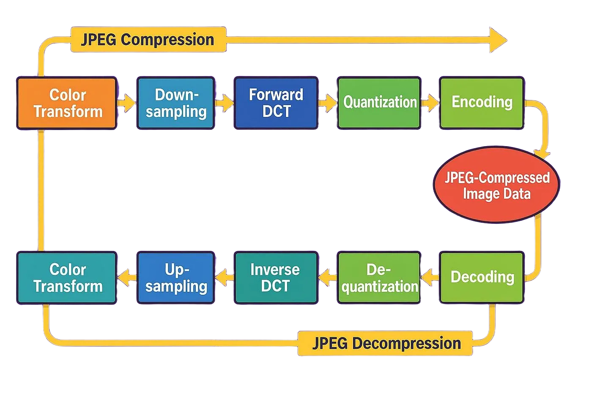
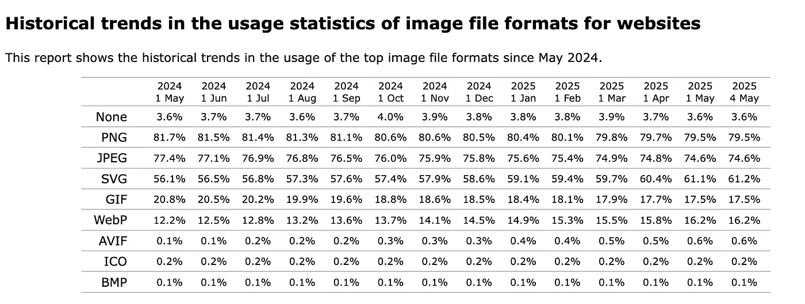
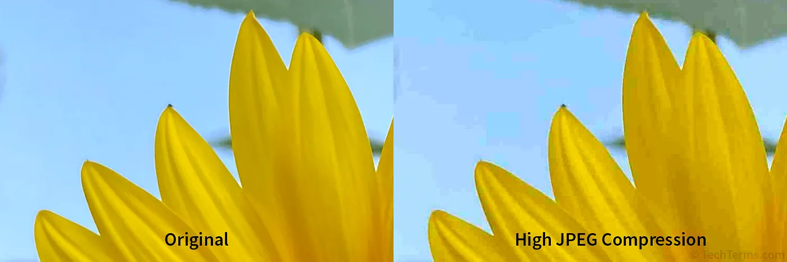
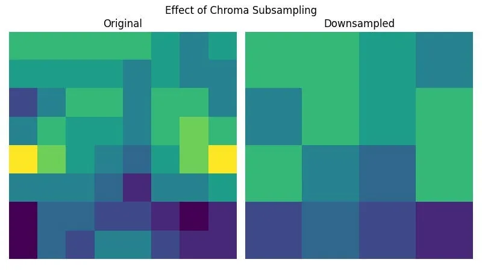
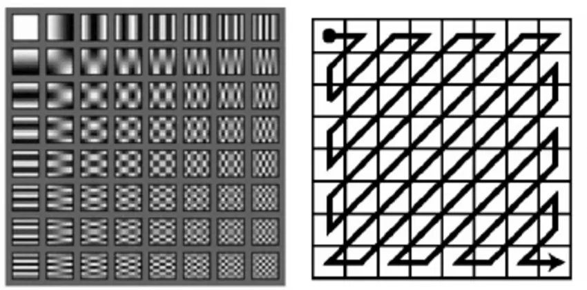
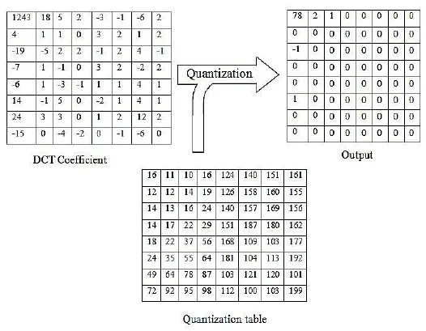
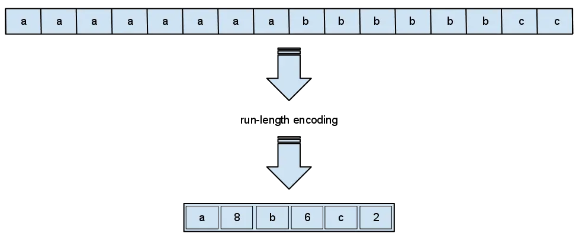

# The Magic Behind Your Photos: A Deep Dive into JPEG Compression

Have you ever taken a photo with your phone or browsed images online? Chances are, you’ve seen a JPEG. JPEG is one of the most widely used image formats today, designed to shrink large image files into much smaller sizes. Making them easier to store and faster to share. As an AI and software engineer, I find JPEG fascinating because of how cleverly it compresses data while keeping images looking sharp to the human eye.

Imagine an uncompressed image as a massive file packed with every tiny pixel of detail. It could easily take up 10 megabytes. Now compare that to a JPEG version, which might be just one-tenth the size. The amazing part? To most people, they look almost identical. That’s because JPEG takes advantage of how our eyes work. It removes details we’re less likely to notice, reducing file size without sacrificing much visible quality.

This kind of smart compression is essential in our digital world. From mobile apps to websites and cloud storage, JPEG allows us to handle huge amounts of image data efficiently. In this article, we’ll break down how the JPEG algorithm works step by step, why it’s so effective, and where it fits in the bigger picture of image compression.

Why is JPEG So Important?
-------------------------

JPEG became a standard in the early 1990s because it offered a good mix of image quality and small file size. Back then, internet speeds were slow, and devices had limited storage, so JPEG was perfect for websites and digital cameras.

Even today, with faster networks and better image formats available, JPEG is still used a lot. It works on almost every device and software, and its compression is still good enough for most purposes. So if you work with digital images, whether in apps, websites, or computer vision, understanding JPEG is essential.

Also, JPEG didn’t just change how we store photos. It influenced how we compress videos too. Modern video formats like H.264 use similar ideas, such as chrominance downsampling, the Discrete Cosine Transform (DCT), and quantization. These shared concepts show how important JPEG is, not just for still images but for the entire field of visual media compression.

What Does JPEG Actually Do?
---------------------------

At its core, JPEG compression is a **lossy** compression method. This means that some information from the original image is permanently removed during compression and cannot be recovered. The key idea behind JPEG is to get rid of parts of the image that the human eye is less sensitive to, so the image still looks near identical even though some data is missing. This allows for a large reduction in file size without a big drop in perceived image quality.

JPEG compression works by analyzing each small block of the image and removing details that are less likely to be noticed. The amount of compression is controlled by a **quality** setting, often shown as a scale from 0% to 100%. A higher quality setting keeps more detail and results in a larger file, while a lower quality setting applies stronger compression, producing a smaller file but with more visible changes.

As the quality setting decreases, the resolution (number of pixels) of the image stays the same, but visual distortions called **compression artifacts** start to appear. These often look like blocky squares across the image. These artifacts are a clear sign that the image has been compressed aggressively using JPEG.

The Five Key Steps of JPEG Compression
--------------------------------------

The JPEG compression algorithm can be broken down into five key steps:

1.  **Color Space Conversion**
2.  **Chrominance Downsampling**
3.  **Discrete Cosine Transform (DCT)**
4.  **Quantization**
5.  **Run Length and Huffman Encoding**

Let’s examine each of these steps in detail.

### 1. Color Space Conversion

Most digital images are initially represented in the **RGB (Red, Green, Blue)** color space. In this model, each pixel’s color is defined by the intensity of its red, green, and blue components, each typically ranging from 0 to 255.

The first step in JPEG compression is to convert this RGB representation into a different color space called **YCbCr**. This conversion is crucial because it separates the image information into:

*   **Luminance (Y):** How bright or dark the pixel is.
*   **Blue Chrominance (Cb):** How much blue color there is compared to a neutral gray.
*   **Red Chrominance (Cr):** How much red color there is compared to a neutral gray.

This conversion is mathematically reversible and, importantly, **no data is lost** during this stage. The rationale behind this step lies in the way human vision perceives color and brightness.

### 2. Chrominance Downsampling

This is the first step where JPEG takes advantage of how the human eye works to reduce file size. Our eyes are much better at noticing changes in brightness (called **luminance**) than changes in color (called **chrominance**). We can easily see small differences in light and shadow, but we are less sensitive to small changes in color.

JPEG uses this fact through a process called **chrominance downsampling**. It reduces the resolution of the Cb and Cr channels. A common method is to group each 2x2 block of chrominance pixels and replace it with their average color. This reduces the amount of chrominance data to one-quarter, while the luminance data stays untouched.

Later, during decompression, the lower-resolution chrominance is scaled back up to match the full image size. This causes some loss in color detail, but because the human eye doesn’t notice small color shifts as much, the result still looks very close to the original. By this point, JPEG has already cut down the image data by almost half, with very little visible quality loss.

### 3. Discrete Cosine Transform (DCT)

Imagine looking at a picture of a forest. You can easily see the edges of the trees and the shapes of the rocks. But you might not be able to clearly see every single blade of grass or every tiny leaf in a bunch of leaves. These tiny details and quick changes in color or brightness are called “high-frequency elements.” Our eyes aren’t as good at picking them out.

JPEG uses a trick to find these high-frequency elements. It divides the image into small 8x8 blocks of pixels (64 pixels in each block). For each block, it does something called the Discrete Cosine Transform (DCT).

Think of the DCT like taking each 8x8 block and breaking it down into a set of 64 basic patterns. Each pattern has a different “frequency.” Some patterns change slowly across the block (low frequency), and some change very quickly (high frequency). The DCT tells us how much of each of these 64 patterns is needed to recreate the original 8x8 block.

After the DCT, we have 64 numbers for each 8x8 block. These numbers represent how much of each of the 64 patterns is present.

### 4. Quantization

Now comes the “quantization” step. This is where the actual data loss happens. A “quantization table” is used. This table has different numbers in it. The numbers in the bottom right of the table are usually bigger. These bigger numbers correspond to the high-frequency patterns.

For each of the 64 numbers from the DCT, we divide it by the corresponding number in the quantization table and then round the result to the nearest whole number.

Why do we do this? Because the bigger numbers in the quantization table make the resulting numbers smaller. For the high-frequency patterns (the ones our eyes don’t see well), we use bigger numbers in the quantization table. This often makes the resulting numbers very small, sometimes even zero. Setting these numbers to zero means we are essentially throwing away those high-frequency details.

We also use a different quantization table for the color information. This table usually has even bigger numbers, meaning we throw away even more of the fine color details.

> _So, after the DCT and quantization, each 8x8 block is now represented by a set of 64 numbers, but many of the numbers, especially those related to high-frequency details, are now zero or very small. This is how JPEG achieves much of its compression._

### 5. Run Length and Huffman Encoding

The last step is to make the list of numbers for each 8x8 block even smaller.

First, the numbers are arranged in a zigzag pattern. This is because after quantization, the non-zero numbers are usually clustered in the top-left corner (representing the important low-frequency details). The zigzag pattern helps to group the long strings of zeros together.

Next, “run length encoding” is used. Instead of listing out many zeros in a row, we just say how many zeros there are. For example, instead of “0, 0, 0, 5, 0, 0,” we might say “(3 zeros), 5, (2 zeros).” This saves space.

Finally, **Huffman Encoding** is a statistical lossless data compression algorithm. It assigns shorter binary codes to more frequently occurring symbols (in this case, the DC coefficients, AC coefficients, and run-length encoded zero counts) and longer binary codes to less frequently occurring symbols. This variable-length coding further reduces the overall file size. The Huffman tables used for luminance and chrominance components are often standardized or can be included within the JPEG file.

How is the Image Rebuilt?
-------------------------

To see the JPEG image, the computer does these steps in reverse:

1.  **Huffman Decoding and Run Length Decoding:** The short codes are turned back into the original numbers, and the counts of zeros are expanded.
2.  **Dequantization:** The numbers are multiplied by the values in the quantization table. This roughly reverses the quantization step.
3.  **Inverse Discrete Cosine Transform (IDCT):** The 64 numbers for each block are used to recreate the 8x8 pixel block using the same 64 basic patterns from before.
4.  **Chrominance Upsampling:** The smaller color information is stretched back to the original size to match the brightness information.
5.  **Color Space Reconversion:** The luminance and chrominance values are converted back into red, green, and blue values for each pixel.

Putting all these blocks together gives us the final JPEG image. It looks very similar to the original, even though it’s much smaller! It is remarkable how these complex mathematical transformations and encoding schemes allow devices like smartphones to compress and decompress millions of pixels in fractions of a second, enabling the seamless capture and display of digital photographs.

Important Things to Know About JPEG
-----------------------------------

*   **Compression Level:** You can often choose how much you want to compress a JPEG. Higher compression means a smaller file but potentially more artifacts. The compression level changes the values in the quantization table. Bigger values in the table lead to more zeros after quantization and thus more compression.
*   **Lossy Compression:** JPEG is called a “lossy” compression method. This means that some information is permanently lost during the compression process (mainly the high-frequency details and some color information). You can’t get the exact original image back from a JPEG.
*   **Best for Photos:** JPEG works very well for compressing photographs of the real world. These images tend to have smooth changes in color and brightness, and the subtle details that are removed are often not very noticeable.
*   **Not Good for Graphics:** JPEG is not the best choice for compressing images with sharp lines and flat areas of color, like logos or computer-generated graphics (vector graphics). In these cases, the loss of information can create noticeable artifacts around the sharp edges. Other formats like PNG are better for these types of images.
*   **Widely Used:** Despite its limitations, JPEG is still the most common image format because it’s been around for a long time, it’s well-understood, and it doesn’t cost anything to use.